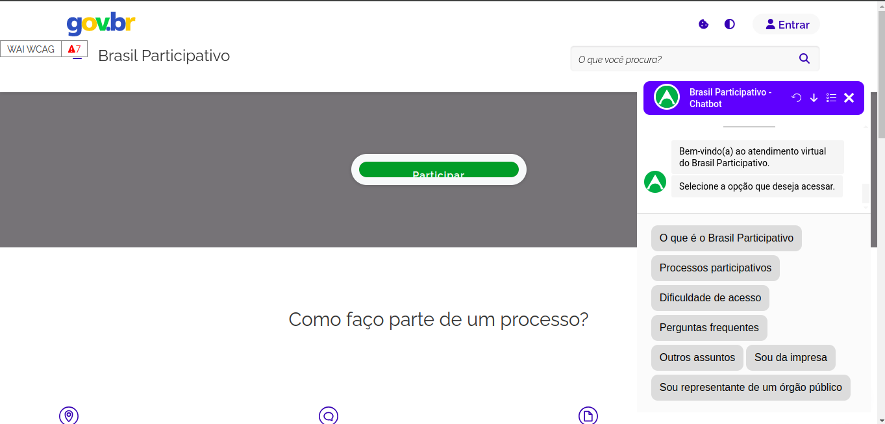

<p align="center">
  
</p>

# Projeto Chatbot para Brasil Participativo

<!-- badges -->
<a href="https://www.gnu.org/licenses/agpl-3.0.html"></a>
<a href="https://botpress.com/docs/cloud/"></a>

Bem-vindo ao repositório oficial do projeto Chatbot para o Brasil Participativo! Este projeto faz parte de uma iniciativa para enriquecer a experiência na plataforma digital do Brasil Participativo, uma plataforma de participação social do governo federal.

---
<!-- Links uteis: -->
* **O que é a Chatbot para Brasil Participativo?** [Conheça o Projeto](#sobre-o-projeto-chatbot)
* **Para ver a documentação com mais detalhes acesse nosso** [GitHub Pages](https://residenciaticbrisa.github.io/T2G2-Chatbot-Participacao-Social/)
* **O que é o Brisa?** [Conheça o Brisa](https://brisa.lappis.rocks/)
* **Como rodar a chat bot no seu computador (Versão telegram)?** [Siga o passo a passo para rodar o bot no telegram](#getting-started)
* **Gostaria de Contribuir?** [Veja como contribuir](https://residenciaticbrisa.github.io/T2G2-Chatbot-Participacao-Social/Pol%C3%ADticas/CONTRIBUTING/)
* **Trocamos de tecnologia, de Rasa para Botpress!** [Entenda o motivo](https://residenciaticbrisa.github.io/T2G2-Chatbot-Participacao-Social/tecnologias/)

---

## Sobre o Brasil Participativo

O Brasil Participativo é uma plataforma desenvolvida em software livre, com o apoio da Dataprev, colaboração da comunidade Decidim-Brasil, parceria com o Ministério da Gestão e Inovação em Serviços Públicos (MGI) e envolvimento da Universidade de Brasília (UnB). A plataforma visa permitir que a sociedade contribua ativamente para o desenvolvimento e aprimoramento das políticas públicas.

## Sobre o Projeto Chatbot

O foco central deste projeto é a implementação de um chatbot destinado a orientar os usuários durante a navegação na plataforma do Brasil Participativo, com o objetivo de esclarecer dúvidas comuns, fornecer suporte e e informar sobre os processos de participação na plataforma em tempo real. O projeto possui médio porte e complexidade, ele necessita de habilidades em Chatbot e Evolução de Software Livre, com Giovanni Alvissus atuando como mentor.

As principais tecnologias utilizadas no projeto serão o JavaScript, devido à sua ampla aceitação e eficácia na construção de aplicações interativas, e o Botpress, que oferece uma plataforma robusta e extensível para o desenvolvimento de chatbots com inteligência artificial. O Botpress facilita a integração de funcionalidades avançadas, permitindo uma interação mais natural e eficiente com os usuários.

Além disso, como o projeto Chatbot de Participação Social será um plugin para a Plataofrma do Brasil Participativo, ele poderá ser utilizado em outros projetos que utilizam a plataforma digital Decidim.
Abaixo temos uma captura de tela do chatbot operando no servidor de teste do site Brasil Participativo. 



O vídeo abaixo é uma demonstração detalhada do funcionamento do nosso Mínimo Produto Viável (MVP) para o site Brasil Participativo. Este vídeo mostra a interface do usuário diretamente no site, onde o chatbot está integrado para melhorar a experiência do usuário.]


## Colaboradores e Parceiros

Este projeto é fruto da colaboração entre a empresa BRISA, o Ministério da Ciência, Tecnologia e Inovação (MCTI) e a Universidade de Brasília. Agradecemos a todos os envolvidos por contribuírem para a evolução do Brasil Participativo.

Sinta-se à vontade para explorar o código-fonte, relatar problemas (issues) e contribuir para o aprimoramento deste projeto. Juntos, estamos construindo uma plataforma mais acessível e interativa para a participação ativa da sociedade.


## Desenvolvedores

<center>
<table style="margin-left: auto; margin-right: auto;">
    <tr>
        <td align="center">
            <a href="https://github.com/GabrielSPinto">
                
                <h5 class="text-center">Gabriel Santos Pinto</h5>
            </a>
        </td>
        <td align="center">
            <a href="https://github.com/GZaranza">
                
                <h5 class="text-center">Gabriel Pessoa Zaranza</h5>
            </a>
        </td>
        <td align="center">
            <a href="https://github.com/Gxaite">
                
                <h5 class="text-center">Gabriel Reis Scheidt Paulino</h5>
            </a>
        </td>
        </td>
        <td align="center">
            <a href="https://github.com/seraphritt">
                
                <h5 class="text-center">Isaque Augusto da Silva Santos</h5>
            </a>
        </td>
        <td align="center">
            <a href="https://github.com/ThiagoMarquesAeroespacial">
                
                <h5 class="text-center">Thiago Henrique Marques Rocha</h5>
            </a>
        </td>
        <td align="center">
            <a href="https://github.com/Eruel6">
                
                <h5 class="text-center">Arthur Taylor de Jesus Popov</h5>
            </a>
        </td>
</table>
</center>

# Getting Started

Este projeto foi desenvolvido no Ubuntu LTS 22.04. Pode funcionar em outros sistemas operacionais, mas ainda não foi testado. Para rodar o projeto, siga as instruções abaixo:

## Pré-requisitos
Certifique-se de estar com o sistema atualizado, no terminal rode o seguinte comado:
```bash
    sudo apt update && sudo apt upgrade
```
Antes de iniciar, certifique-se de que você tenha os seguintes softwares instalados na sua máquina:

- Git [guia de instalação](https://git-scm.com/download/linux)
- Docker e docker compose [guia de instalação](https://docs.docker.com/engine/install/ubuntu/#install-using-the-repository)

## Passo 2: Clonar o Repositório

1. Abra o terminal ou prompt de comando.
2. Clone o repositório usando o comando:

```bash
    git clone https://github.com/ResidenciaTICBrisa/T2G2-Chatbot-Participacao-Social
```

## Passo 3: Configurar o Arquivo .env
1. Crie um arquivo .env no diretório raiz do projeto.
2. Abra o arquivo .env com seu editor de texto preferido.
3. Adicione a seguintes linhas ao arquivo .env e substitua os '*' pelas credenciais que deseja criar no botpress:

    ```bash
    #Credenciais do postgres
    POSTGRES_DB= * #Nome do dbanco de dados
    POSTGRES_USER= * #Usuário postgress
    POSTGRES_PASSWORD= * #Senha do usuário postgres

    #Credenciais da conta de administrador do pgadmin
    PGADMIN_DEFAULT_EMAIL= * #email do usuário pgadmin
    PGADMIN_DEFAULT_PASSWORD= * #Senha do usuário pgadmin

    #Credencias da conta administrador do botpress
    BOTPRESS_ADMIN_EMAIL= * #Email da conta administrador
    BOTPRESS_ADMIN_PASSWORD=* #Senha da conta administrador
    ```
## Passo 4: Executar o docker compose
De o seguinte comando para rodar o sistema:
```bash
    docker compose -f docker-compose-local.yml up
```

## Passo 5: Acessar o sistema
Se tudo tiver sido da forma adequada, acesse o projeto através do 
[http://localhost:3000](http://localhost:3000)


### Onde Buscar Informações

Se você está utilizando ou explorando o Botpress versão 12, aqui estão alguns recursos importantes para ajudar na sua jornada:

- **Documentação Oficial (v12:latest):** Para acessar a documentação mais recente do Botpress v12, visite [Documentação Botpress v12:latest](https://v12.botpress.com/).

- **Documentação Botpress v12.26.7:** Caso esteja trabalhando especificamente com a versão v12.26.7, a documentação correspondente pode ser encontrada em [Documentação Botpress v12.26.7](http://botpress-docs.s3-website-us-east-1.amazonaws.com/docs/introduction/).

- **Repositório no GitHub:** Para acessar o código-fonte e contribuir para o desenvolvimento, acesse o repositório oficial do Botpress v12 no GitHub: [GitHub Botpress v12](https://github.com/botpress/v12).

Certifique-se de explorar esses recursos para obter todas as informações necessárias sobre o Botpress e seu uso!

## Documentação
- [Cronograma](https://residenciaticbrisa.github.io/T2G2-Chatbot-Participacao-Social/cronogramas/Cronograma%20Detalhado/)
- [Backlog do produto](https://residenciaticbrisa.github.io/T2G2-Chatbot-Participacao-Social/backlog/)
- [Releases](https://residenciaticbrisa.github.io/T2G2-Chatbot-Participacao-Social/releases/release1/)
- [Arquitetura](https://residenciaticbrisa.github.io/T2G2-Chatbot-Participacao-Social/arquitetura/)
- [Atas de reunião](https://residenciaticbrisa.github.io/T2G2-Chatbot-Participacao-Social/atas_de_reuni%C3%B5es/Reuni%C3%A3o%2001/)
