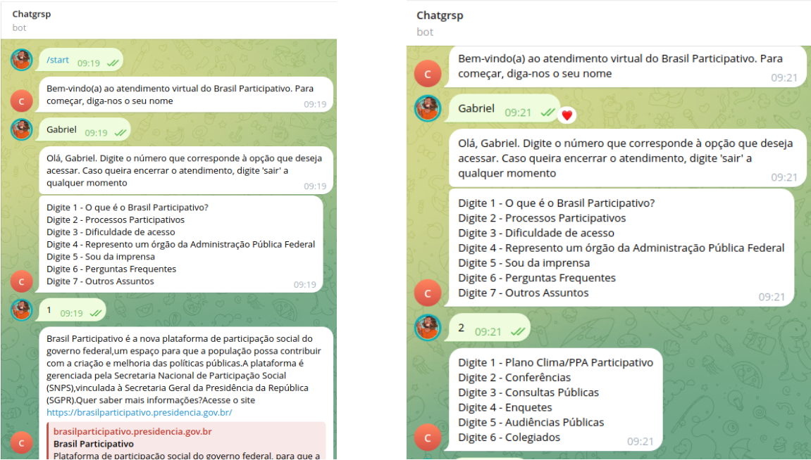

# **1º MVP - Versão Telegram**

  <iframe loading="lazy" style="position: absolute; width: 100%; height: 100%; top: 0; left: 0; border: none; padding: 0;margin: 0;"
    src="https:&#x2F;&#x2F;www.canva.com&#x2F;design&#x2F;DAGB1eJv_gI&#x2F;3iuK7XZImEUn--5-2PkJbQ&#x2F;view?embed" allowfullscreen="allowfullscreen" allow="fullscreen">
  </iframe>

<a href="https:&#x2F;&#x2F;www.canva.com&#x2F;design&#x2F;DAGB1eJv_gI&#x2F;3iuK7XZImEUn--5-2PkJbQ&#x2F;view?utm_content=DAGB1eJv_gI&amp;utm_campaign=designshare&amp;utm_medium=embeds&amp;utm_source=link" target="_blank" rel="noopener">MVP</a>

&emsp;&emsp;O Mínimo Produto Viável (MVP) é uma abordagem essencial no desenvolvimento de produtos, cujo principal objetivo é criar uma versão inicial simplificada que entregue a proposta de valor central da ideia. Para esta finalidade, utilizamos a ferramenta Canva para a produção do MVP.

&emsp;&emsp;O MVP desempenha um papel crucial no desenvolvimento do produto, pois fornece uma visão geral que ajuda a determinar sua viabilidade e funcionalidades. Além disso, permite a identificação de problemas e áreas de melhoria, contribuindo para a redução de riscos à medida que a equipe avalia a aceitação do público. Essa avaliação direciona o foco da equipe para as partes mais importantes do projeto. A divisão do MVP em categorias facilita ainda mais essa análise.

## **Plataformas:**

&emsp;&emsp;Foram utilizadas diversas plataformas no desenvolvimento e teste do projeto. O Telegram serviu como interface visual para os testes do chatbot, enquanto o site do Brasil Participativo, que representa o cliente final da aplicação, foi o ambiente onde o MVP foi avaliado. Além disso, o GitHub foi utilizado para elaborar a GitPage e documentar o projeto de forma colaborativa.

## **Visão do MVP:**

&emsp;&emsp;Nosso MVP é um chatbot de assistência virtual projetado para facilitar a experiência dos usuários no site Brasil Participativo, ajudando-os na navegação e compreensão do ambiente virtual.

## **Funcionalidade:**

&emsp;&emsp;Nosso MVP rodará no servidor e estará sempre disponivel para teste, a implementação do bot é baseada na seleção com números, o usuário segue o fluxo estabelecido pelo cliente.

## **Resultado Esperado:**

&emsp;&emsp;Nosso MVP será executado em um servidor e estará constantemente disponível para testes. A implementação do bot é baseada em seleções numéricas, permitindo que o usuário siga o fluxo estabelecido pelo cliente de forma intuitiva e eficiente.

## **Jornadas:**

&emsp;&emsp;O percurso do usuário começa quando ele acessa o site e utiliza o widget para se comunicar com o chatbot. Enquanto isso, os desenvolvedores têm a flexibilidade de modificar completamente o funcionamento e a lógica do chatbot durante suas jornadas.

## **Métricas para Validar as Hipóteses de Negócio:**

&emsp;&emsp;A métrica de validação consiste em verificar se o usuário consegue concluir a conversa de forma satisfatória, mantendo um baixo nível de desvio entre os fluxos. Além disso, a satisfação do usuário final em relação ao produto também é considerada um indicador positivo de validação.

## **Custo e Cronograma:**

&emsp;&emsp;O grupo é composto por seis pessoas, dedicando um total de 120 horas semanais. Desenvolvemos nosso MVP ao longo de um período de dois meses.

## Histórico de versão

| Versão |    Data    |           Descrição            |      Autor      |
|:------:|:----------:|:------------------------------:|:---------------:|
|  1.0   | 28/03/2024 | Criação do documento           | Gabriel Scheidt |
|  2.0   | 28/03/2024 |  Alteração de layout e do MVP  | Gabriel Scheidt |
|  2.1   | 08/04/2024 |       Atualização do MVP       | Isaque Augusto  |