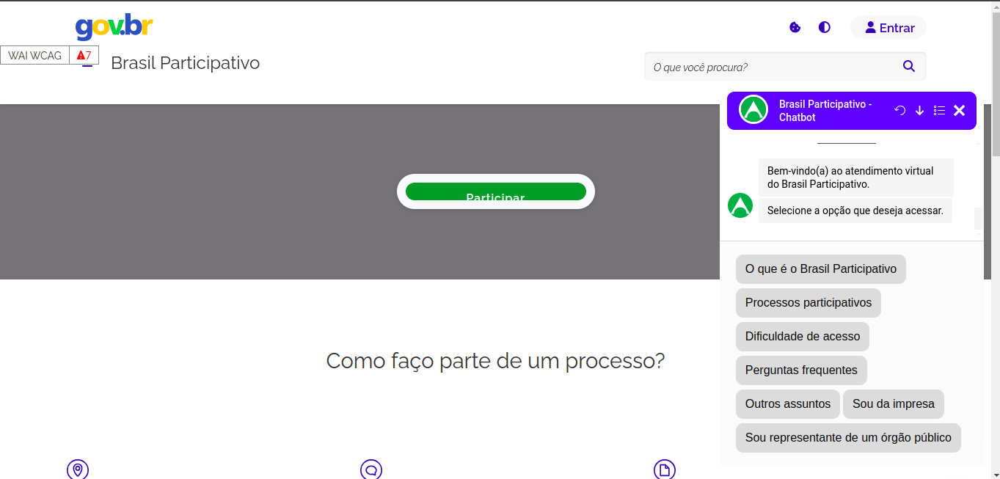

# **2º MVP - Versão Botpress**

  <iframe width="560" height="315" src="https://www.youtube.com/embed/Xub_9X0AarM" frameborder="0" allow="accelerometer; autoplay; clipboard-write; encrypted-media; gyroscope; picture-in-picture" allowfullscreen></iframe>

&emsp;&emsp;O vídeo é uma demonstração detalhada do funcionamento do nosso Mínimo Produto Viável (MVP) para o site Brasil Participativo. Este vídeo mostra a interface do usuário diretamente no site, onde o chatbot está integrado para melhorar a experiência do usuário.

**Figura 1:** Captura de tela do chatbot operando no servidor de teste do site Brasil Participativo. 

&emsp;&emsp;Na imagem temos a interface do usuário onde o chatbot está ativo, destacando como ele interage com os visitantes do site. A interface do chatbot é projetada para ser intuitiva, permitindo que os usuários naveguem facilmente pelas opções disponíveis e obtenham respostas eficientes para suas consultas. Este teste demonstra a funcionalidade do chatbot em um ambiente real, assegurando que o sistema é robusto e confiável para uso público.

## **Plataformas:**

&emsp;&emsp;A plataforma utilizada no desenvolvimento e teste do projeto foi o Botpress enquanto o site Brasil Participativo serviu como o ambiente de avaliação do MVP, representando o cliente final. O GitHub foi utilizado para a elaboração da GitPage e para a documentação colaborativa do projeto.

## **Visão do MVP:**

&emsp;&emsp;O MVP consiste em um chatbot de assistência virtual projetado para otimizar a experiência dos usuários no site Brasil Participativo, auxiliando-os na navegação e compreensão do ambiente virtual.

## **Funcionalidade:**

&emsp;&emsp;O MVP é operado em um servidor, estando sempre disponível para testes. Sua implementação é baseada na seleção de botões com perguntas predefinidas, guiando o usuário conforme o fluxo determinado pelo cliente.

## **Resultado Esperado:**

&emsp;&emsp;O MVP é executado em um servidor e está constantemente acessível para testes. Sua implementação permite ao usuário seguir o fluxo estabelecido pelo cliente de maneira intuitiva e eficiente, por meio de seleções de botões.

## **Jornadas:**

&emsp;&emsp;A jornada do usuário inicia ao acessar o site e utilizar o widget para interagir com o chatbot. Simultaneamente, os desenvolvedores têm a flexibilidade de modificar completamente a funcionalidade e a lógica do chatbot durante essas jornadas.

## **Métricas para Validar as Hipóteses de Negócio:**

&emsp;&emsp;A métrica de validação é verificar se o usuário consegue concluir a conversa de maneira satisfatória, mantendo um baixo nível de desvio entre os fluxos. A satisfação do usuário final em relação ao produto também é considerada um indicador chave de validação.

## **Custo e Cronograma:**

&emsp;&emsp;O grupo é formado por seis pessoas, dedicando um total de 120 horas semanais ao projeto. O desenvolvimento do MVP começou em 19/04/2024 e foi concluído em 03/05/2024.

## Histórico de versão

| Versão |    Data    |           Descrição            |      Autor      |
|:------:|:----------:|:------------------------------:|:---------------:|
|  1.0   | 10/05/2024 | Criação do documento           | Thiago Marques  |