# Criação de bot com Linguaem Natural (NLU)

## Logar no painel de admin do botpress

Para criação ou alteração de um bot é nescessário fazer login com email e senha que foram utilizados para criação da conta no botpress, esta conta é a conta de administrador.

## Clicar no botão Create bot

No canto superior direito do painel inicial após o login existe um botão "Create Bot", ao colocar o cursor sobre este botão serão apresentadas duas opções para a criação de um novo bot

### "New bot"

Ao selecionar o botão para criar um novo bot, uma janela será exibida onde algumas opções devem ser preenchidas.

- Bot name: deve ser preenchido com o nome desejado para seu Bot.

- Bot ID: neste campo deve ser informado o ID do bot, este ID deve ser exclusivo para o bot. (Este ID não pode ser mudado depois de selecionado).

- Bot template: Aqui pode ser selecionado algum dos templates de bot disponibilizados pelo botpress, também é possível criar um bot totalmente novo através da seleção da opção "empty bot".

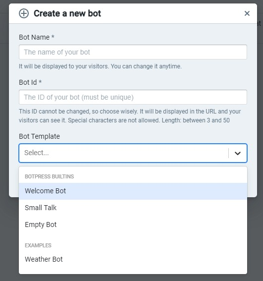

### Import Bot

De forma semelhante ao selecionar o botão "new bot" uma janela será exibida para que sejam preenchidas algumas informações.

- Bot ID: neste campo deve ser informado o ID do bot, o ID deve ser exclusivo para o bot. (Este ID não pode ser mudado depois de selecionado)

- Arquivo do bot: Deve ser selecionado um arquivo para importar as configurações de um bot pré feito. (existe uma opção de exportar um bot feito e treinado)

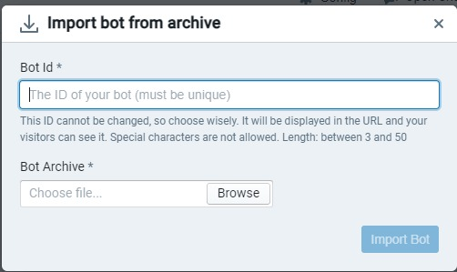

## Visualizando seus bots

Todos os bots criados devem aparecer na área principal do painel de adiministrador, logo uma vez criado um novo bot ele deverá aparecer nesta área

### Adicionando Linguagem Natural ao seu Bot

A priemeira opção Natural Language Understanding pode ser usada para adicionar linguagem natural em um fluxo existente. Já a segunda opção destacada Q&A, funciona independetemente do fluxo, utilizando palavras chaves como perguntas e respostas pré definidas. 

#### Quando usar cada opção de criação de Bot NLU:

NLU: Melhor para conversas mais dinâmicas e contextuais, onde o bot precisa entender a intenção por trás das perguntas e fornecer respostas ou ações baseadas em um entendimento mais profundo.

Q&A: Melhor para cenários onde as perguntas são previsíveis e as respostas são fixas, funcionando bem para bots de suporte com perguntas e respostas simples e diretas.

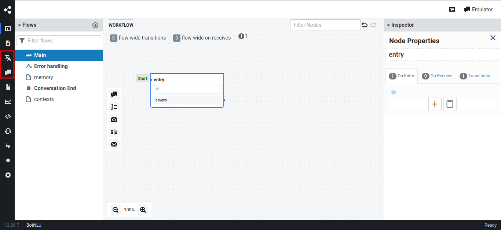

Se o seu projeto exige flexibilidade e entendimento da linguagem natural em várias situações, o NLU é mais adequado. Se o foco é responder perguntas específicas de maneira direta e eficiente, o Q&A pode ser a melhor escolha.

#### Utilizando a opção Natural Language Understanding (NLU)

**Criar Intenções (Intents):** Clique em "Create Intent" para adicionar novas intenções que o bot deve reconhecer. Por exemplo, intenções como "comprar produto", "verificar status", etc.

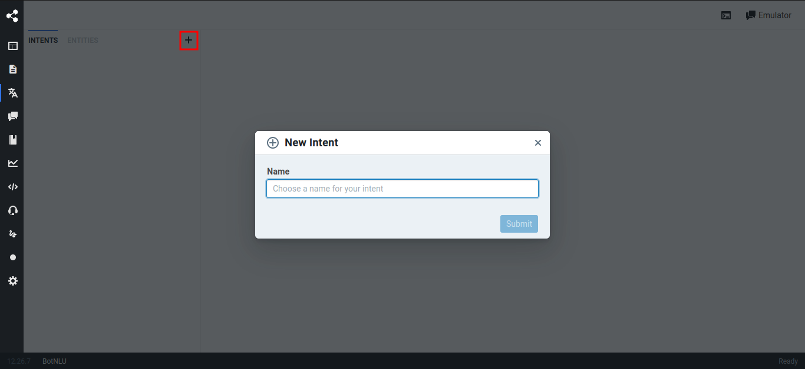

Agora você vai criar os Contextos (Contexts) que são as possíveis perguntas que o usuário do chat poderá fazer para o seu Chatbot. Você deverá criar pelo menos 10 contextos de sentenças. Quanto mais você adicionar variações da pergunta, melhor será o funcionamento do NLU.

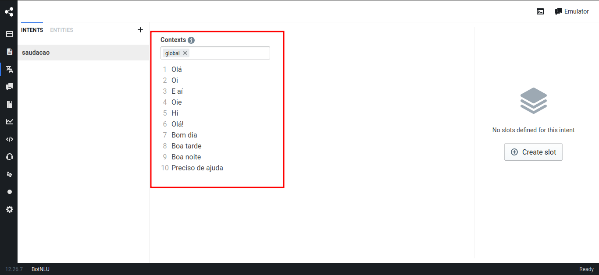

**Fluxos:** Vá para a aba "Flows" e crie fluxos que guiarão a interação do usuário com o bot.

**Conectar Intenções:** Nos fluxos, conecte as intenções do NLU às ações ou mensagens que o bot deve executar. Por exemplo, quando o NLU detectar a intenção "comprar produto", você pode direcionar o usuário para um fluxo onde ele escolhe o produto e finaliza a compra.

**Adicionando Ações:** Adicione ações como enviar uma mensagem, redirecionar para outro fluxo, chamar uma API, etc., de acordo com as intenções capturadas.

Para aplicar o NLU no fluxo, faremos a edição de Transições, para que elas se tornem condicionais das intenções adicionadas no NLU. Clique no botão "Edit" para fazer as alterações da transição.

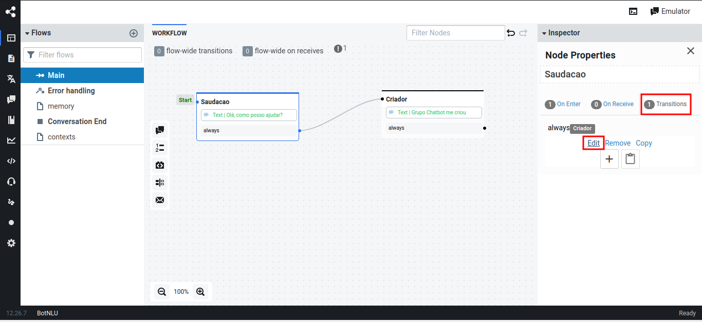

Agora, você irá especificar a Intent que utilizará e qual nó será visitado se a entrada do usuário for correspondente à Intenção selecionada.

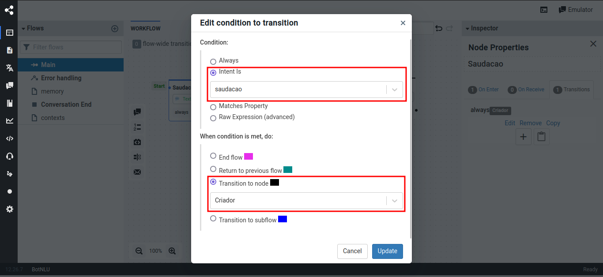

#### Utilizando a opção Q&A

Clique em "Add question" para adicionar uma nova pergunta e a resposta correspondente.

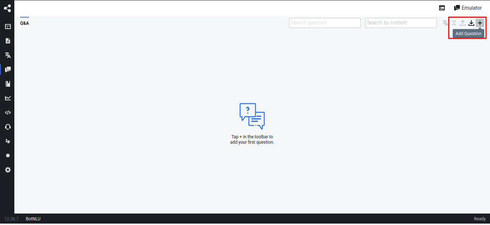

**Definir Pergunta:** No campo de pergunta, insira a pergunta que o usuário provavelmente fará. Você pode adicionar várias variações dessa pergunta para garantir que o bot consiga reconhecê-la em diferentes formas.

**Adicionar Resposta:** No campo de resposta, insira a resposta que o bot deve fornecer quando essa pergunta for reconhecida.

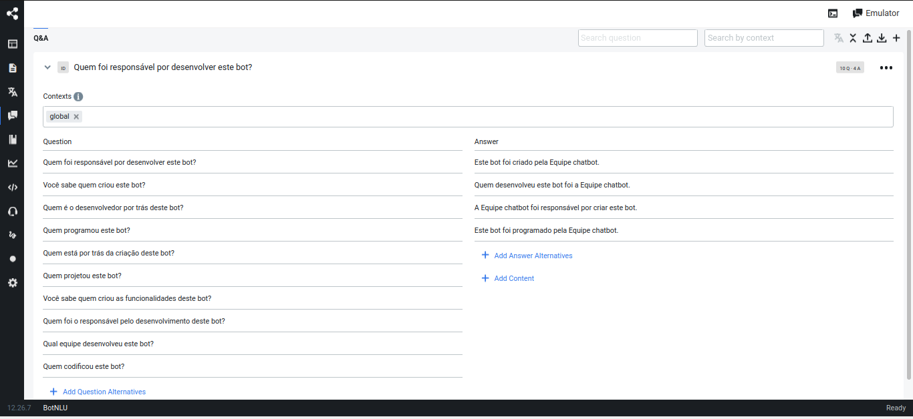

Voltando ao fluxo, selecione o nó que deseja alterar e seleciona a aba "On receive" e selecione a opção "Wait for user message". Para a resposta ser exibida após a entrada do usuário.

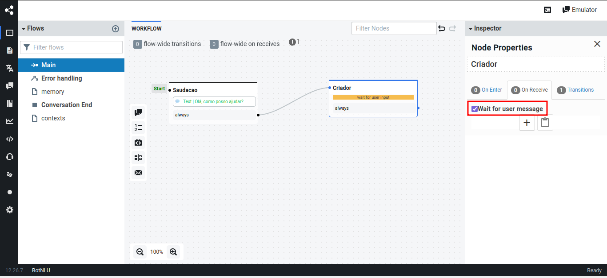

Após isso, na aba "On receive"faça a edição no texto.

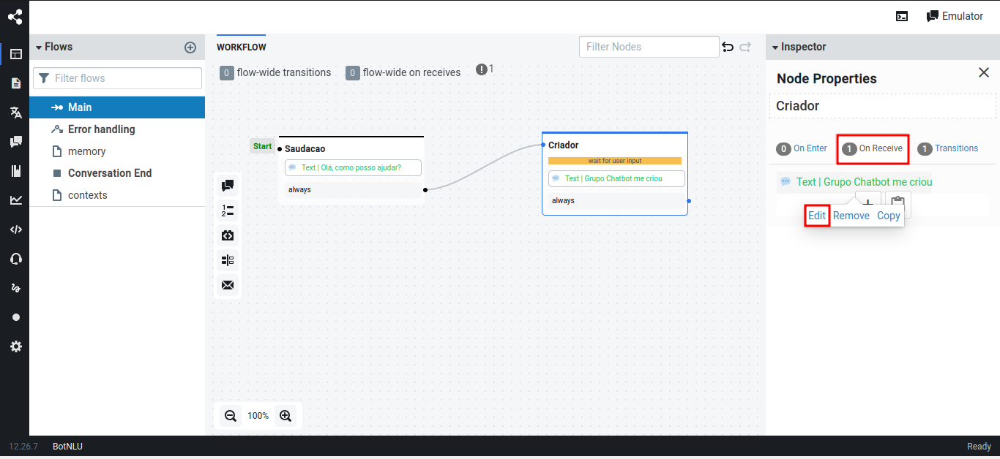

Faça a edição de texto necessária, adicionando o texto que será a resposta do bot ao entrar no nó correspondente.

| Versão |    Data    |                       Descrição                       |      Autor       |
| :----: | :--------: | :---------------------------------------------------: | :--------------: |
|  1.0   | 14/08/2024 |           Criação do documento                        |  Gabriel Pinto  |