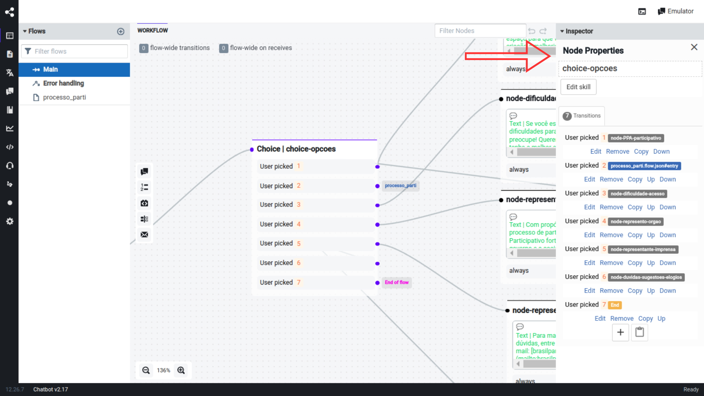

# Como alterar as caixas de perguntas

## Tutorial em vídeo

<iframe width="560" height="315" src="https://www.youtube.com/embed/IWsbCVlCqZU" frameborder="0" allow="accelerometer; autoplay; clipboard-write; encrypted-media; gyroscope; picture-in-picture" allowfullscreen></iframe>

## Logar no painel de admin do Botpress

Para fazer alterações nas caixas de perguntas de um bot, é necessário fazer login com o email e senha utilizados na criação da conta no Botpress. Esta conta é a de administrador, necessária para a criação e modificação de bots.

## Selecionar o BOT a ser alterado

Para realizar a alteração das caixas de perguntas, deve-se selecionar o bot específico que será alterado. Os bots serão exibidos na página inicial do painel de administrador do Botpress.

## Navegar para a seção de perguntas

Uma vez selecionado o bot, navegue até a seção onde as caixas de perguntas são configuradas. Normalmente, esta seção está dentro dos fluxos do bot. Visualizando o fluxo, identifique em qual choice que será feita as alterações.

Identificado o choice, clique nele com o botão esquerdo do mouse:

Será aberto esse menu lateral com as perguntas já contidas no choice:

Clique no botão "edit skill" para ter acesso ao menu "edit a skill":

Dentro do menu "edit a skill", clique no ícone em destaque, assim o menu de edição do choice será aberto:

### Como adicionar novas perguntas

Para adicionar novas perguntas, dentro do menu de edição do choice, desça até visualizar o botão "Add Choice": 

Clicando no botão, será aberta uma nova caixa para adicionar a sua nova pergunta, na primeira caixa deve ser adicionada a pergunta e na segunda caixa o número de identificação da pergunta dentro do choice:

Após adicionar a pergunta, clique no botão "Submit":

Em seguida salve as alterações clicando no botão "Save":

#### Modificando uma pergunta existente

Para modificar uma pergunta existente, dentro do menu de edição do choice, localize a pergunta que você quer editar e clique nela:

Após editar desça até visualizar o botão "Submit":

Em seguida salve as alterações clicando no botão "Save":

### Onde Buscar Informações

Se você está utilizando ou explorando o Botpress versão 12, aqui estão alguns recursos importantes para ajudar na sua jornada:

- **Documentação Oficial (v12:latest):** Para acessar a documentação mais recente do Botpress v12, visite [Documentação Botpress v12:latest](https://v12.botpress.com/).

- **Documentação Botpress v12.26.7:** Caso esteja trabalhando especificamente com a versão v12.26.7, a documentação correspondente pode ser encontrada em [Documentação Botpress v12.26.7](http://botpress-docs.s3-website-us-east-1.amazonaws.com/docs/introduction/).

- **Repositório no GitHub:** Para acessar o código-fonte e contribuir para o desenvolvimento, acesse o repositório oficial do Botpress v12 no GitHub: [GitHub Botpress v12](https://github.com/botpress/v12).

Certifique-se de explorar esses recursos para obter todas as informações necessárias sobre o Botpress e seu uso!

| Versão |    Data    |                       Descrição                       |      Autor       |
| :----: | :--------: | :---------------------------------------------------: | :--------------: |
|  1.0   | 12/08/2024 |           Criação do documento                        |  Thiago Marques  |
