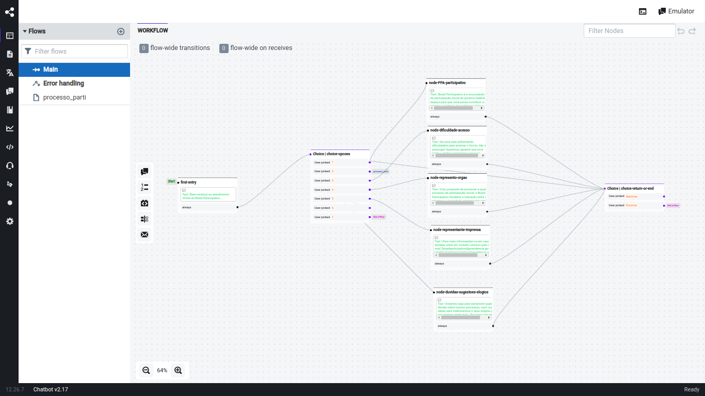

# Como alterar as as respostas do BOT

## Logar no painel de admin do Botpress

Para fazer alterações nas respostas de um bot, é necessário fazer login com o email e senha utilizados na criação da conta no Botpress. Esta conta é a de administrador, necessária para a criação e modificação de bots.

## Selecionar o BOT a ser alterado

Para realizar a alteração, deve-se selecionar o bot específico que será alterado. Os bots serão exibidos na página inicial do painel de administrador do Botpress.

## Navegar para a seção de respostas
Uma vez selecionado o bot, navegue até a seção onde as caixas de respostas são configuradas. Normalmente, esta seção está dentro dos fluxos do bot. Visualizando o fluxo, identifique em qual node que será feita as alterações.

Identificado o node, clique nele com o botão esquerdo do mouse:

Será aberto esse menu lateral com as respostas já contidas no node:

Passe o mouse sobre o texto em verde e clique no "Edit" para ter acesso ao menu de edição da resposta.

Após clicar em "Edit", clique no ícone em destaque, assim o menu de edição do node será aberto:

Edite a mensagem e após isso clique em "submit" e em "Update Action (Alt + Enter)".

### Como adicionar novas alternativas de respostas

Existe também a opção de adicionar alternativas de respostas para uma mesma pergunta. Uma dessas alternativas será escolhida aleatoriamente pelo chatbot.

Para adicionar alternativas, basta seguir as mesmas instruções para abrir o menu de edição e clicar no botão em destaque "Add alternates" que está localizado na parte de baixo do menu de edição.

Após isso, assim como dito alteriormente, escreva a nova alternativa de resposta e clique em "submit" e em "Update Action (Alt + Enter)"

### Onde Buscar Informações

Se você está utilizando ou explorando o Botpress versão 12, aqui estão alguns recursos importantes para ajudar na sua jornada:

- **Documentação Oficial (v12:latest):** Para acessar a documentação mais recente do Botpress v12, visite [Documentação Botpress v12:latest](https://v12.botpress.com/).

- **Documentação Botpress v12.26.7:** Caso esteja trabalhando especificamente com a versão v12.26.7, a documentação correspondente pode ser encontrada em [Documentação Botpress v12.26.7](http://botpress-docs.s3-website-us-east-1.amazonaws.com/docs/introduction/).

- **Repositório no GitHub:** Para acessar o código-fonte e contribuir para o desenvolvimento, acesse o repositório oficial do Botpress v12 no GitHub: [GitHub Botpress v12](https://github.com/botpress/v12).

Certifique-se de explorar esses recursos para obter todas as informações necessárias sobre o Botpress e seu uso!

| Versão |    Data    |                       Descrição                       |      Autor       |
| :----: | :--------: | :---------------------------------------------------: | :--------------: |
|  1.0   | 13/08/2024 |           Criação do documento                        |  Thiago Marques  |