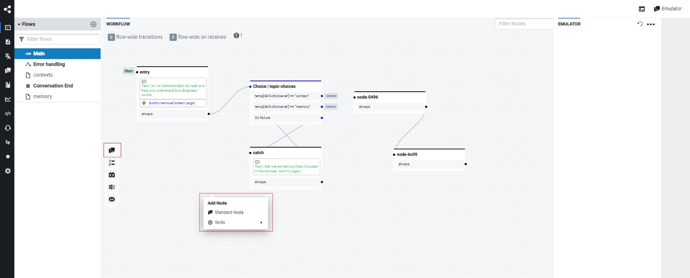

# Como mudar os fluxos de um bot

## Logar no painel de admin do botpress

Para criação ou alteração de um bot é nescessário fazer login com email e senha que foram utilizados para criação da conta no botpress, esta conta é a conta de administrador.

## Selecionar o BOT a ser alterado

Para realizar a alteração do fluxo deve ser selecionado o BOT que deve ser alterado, os bots serão exibidos na página inicial do painel de administradr do botpress.

## Mudando os fluxos

Uma vez selecionado o bot será apresentado a tela onde é exibido os fluxos do bot

*Caso saia da tela de visualização dos fluxos é possíve retornar clicando no primeiro ícone (indicado pela marcação em verde na imagem)*

## Modificando um fluxo existente

Por padrão o fluxo exibido será o fluxo main, outros fluxos podem ser acessados ao serem selecionados com o clique esquerdo em cima de seu nome.

Quando for selecionado o fluxo irá ser exibido na tela e mostrará todos os nós e transições que compõe o fluxo.

### Como adicionar novos nós

Os nós são os pontos onde as decisões ocorrem(lógicas, por exemplo textos que serão apresentados para o usuário).

Para criar novos nós existem duas opções, existe a possibilidade de criar um novo nó com o primeiro botão das ferramentas, ou então com o clique direito do mouse no fluxo e selecionando a opção para um novo nó.

#### Modificando os nós 

Ao utilizar o clique esquerdo sobre um nó, é possível abrir o inspector deste nó e configurar as suas características, começando com o nome do nó. 

Além da possibilidade de modificar o nome dos nós é possível modificar os comportamentos do BOT, como o que acontecerá quando ocorrer uma entrada neste nó (On enter). Pode ser utilizado também a funcionalidade onde ocorre uma espera pela ação do usuário (On receive). A última funcionalidade do inspector é a funcionalidades de transitions, onde é possível definir como serão feitas as transições do fluxo e como serão feitas. 

### Como realizar as transições

Para realizar transições entre os nós, pode ser realizando utilizando os pontos pretos ao lado dos cartões dos nós para conectar à outro, realizando assim uma transição entre estes nós. 

Outra forma possível seria utilizar a funcionalidade de inspector de um nó e utilizando a aba transictions. 

### Treinamento 

Após realizar os passos para alteração de fluxo, deve ser realizao o treinamento do bot na parte inferior direita da página do botpress para que sejam refletidas assim as mudanças realizadas.

### Onde Buscar Informações

Se você está utilizando ou explorando o Botpress versão 12, aqui estão alguns recursos importantes para ajudar na sua jornada:

- **Documentação Oficial (v12:latest):** Para acessar a documentação mais recente do Botpress v12, visite [Documentação Botpress v12:latest](https://v12.botpress.com/).

- **Documentação Botpress v12.26.7:** Caso esteja trabalhando especificamente com a versão v12.26.7, a documentação correspondente pode ser encontrada em [Documentação Botpress v12.26.7](http://botpress-docs.s3-website-us-east-1.amazonaws.com/docs/introduction/).

- **Repositório no GitHub:** Para acessar o código-fonte e contribuir para o desenvolvimento, acesse o repositório oficial do Botpress v12 no GitHub: [GitHub Botpress v12](https://github.com/botpress/v12).

Certifique-se de explorar esses recursos para obter todas as informações necessárias sobre o Botpress e seu uso!

| Versão |    Data    |                       Descrição                       |      Autor       |
| :----: | :--------: | :---------------------------------------------------: | :--------------: |
|  1.0   | 08/08/2024 |           Criação do documento                        |  Arthur Taylor  |